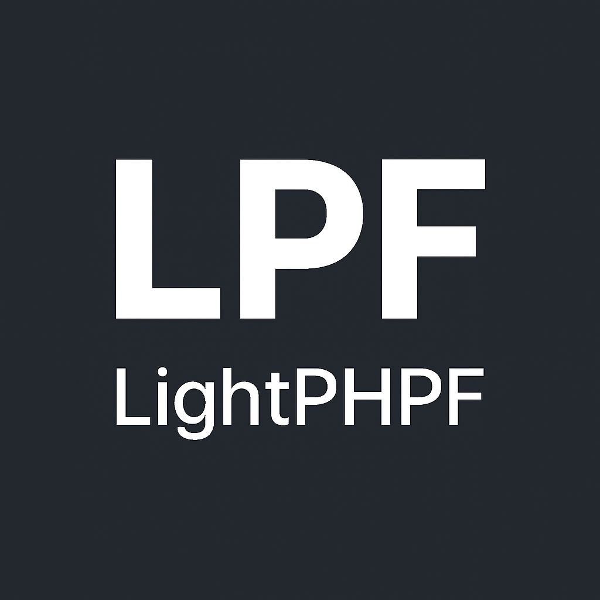
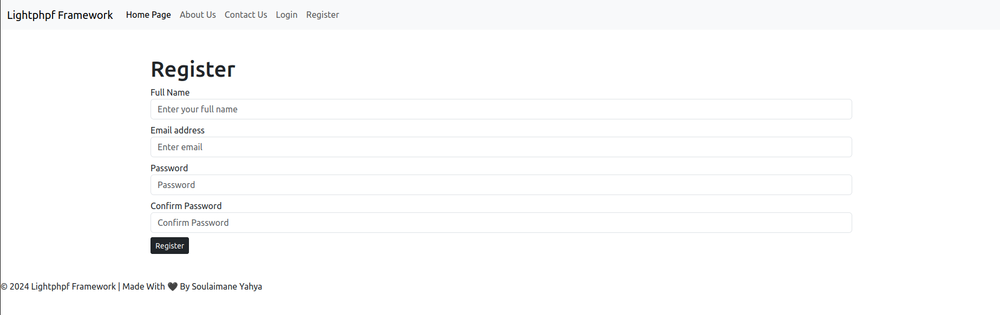

# LightPHPF

<a href="https://github.com/lightphpf" target="_blank"></a>

[](https://github.com/lightphpf/lightphpf/actions/workflows/ci.yml)
[](https://packagist.org/packages/lightphpf/lightphpf)
[](https://github.com/lightphpf/lightphpf/blob/main/LICENSE)

LightPHPF is a micro PHP framework that follows the Model-View-Controller (MVC) architecture pattern.
It is specifically designed for small school or enterprise projects that require a lightweight and efficient framework to build web applications.

LightPHPF supports:

* [x] MVC Architecture
* [x] Routing system; matches route, decides controller/action
* [x] Database connection; load db config; using singleton-class
* [x] Twig template engine
* [x] Console Command; clear-cache
* [⏳] IOC dependency injection container
* [⏳] LightPHPF middleware

## LightPHPF starter kit



### install requirements

Install;
```sh
composer global require lightphpf/core
export PATH="$PATH:$(pwd)/vendor/bin"
```

```sh
composer create-project lightphpf/lightphpf <my-app-name>
```

## lightphpf cli:

clear cache;
```sh
lightphpf clear:cache
```

---

Need helps? Reach me out

> Email: soulaimaneyahya1@gmail.com

> Linkedin: soulaimane-yahya

All the best :beer:
